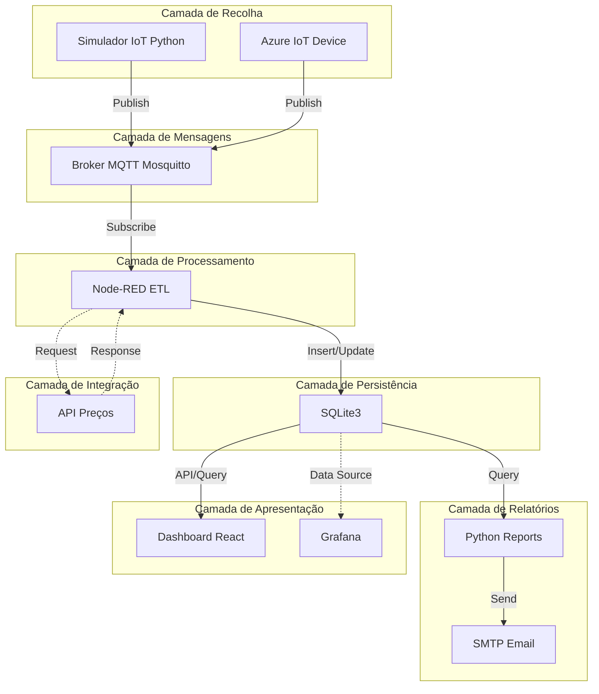

# Arquitetura Técnica do Projeto

A arquitetura do **ProjetoISIv1** implementa um sistema distribuído que suporta todo o ciclo de vida dos dados industriais: **recolha**, **processamento**, **armazenamento** e **visualização**.

---

## Visão Geral da Arquitetura

O sistema segue uma arquitetura orientada a eventos (Event-Driven Architecture) baseada no protocolo MQTT, permitindo comunicação assíncrona e em tempo real entre os componentes.

### Princípios Arquiteturais

- **Desacoplamento**: Componentes comunicam através de mensagens MQTT
- **Escalabilidade**: Arquitetura permite adicionar novos sensores sem alterações
- **Modularidade**: Cada componente tem responsabilidades bem definidas
- **Persistência**: Dados armazenados de forma estruturada e auditável
- **Extensibilidade**: Fácil integração com novos sistemas e APIs

---

## Componentes do Sistema

### 1. Camada de Recolha de Dados

#### 1.1 Publisher - Simulador MQTT (Python)

**Responsabilidade**: Simular sensores IoT em ambiente industrial

**Funcionalidades**:

- Geração de dados sintéticos de produção, stock, paragens e defeitos
- Publicação de mensagens JSON em tópicos MQTT específicos por estação
- Configuração flexível através de ficheiros JSON
- Suporte para múltiplos dispositivos e cenários de simulação

**Tecnologias**: Python 3.10+, biblioteca `paho-mqtt`

**Tópicos MQTT**:
```
fabrica/estacao/{id}/producao
fabrica/estacao/{id}/stock
fabrica/estacao/{id}/paragem
fabrica/estacao/{id}/defeitos
```

#### 1.2 Integração Azure IoT (Fase 2)

**Funcionalidades**:

- Conexão com Azure IoT Hub
- Envio de telemetria para a cloud
- Sincronização device-to-cloud

---

### 2. Camada de Mensagens

#### 2.1 Broker MQTT - Eclipse Mosquitto

**Responsabilidade**: Intermediário de mensagens entre publishers e subscribers

**Características**:

- Protocolo MQTT v3.1.1 / v5.0
- Porta padrão: `1883` (não encriptado) / `8883` (TLS)
- Suporte para QoS (Quality of Service) níveis 0, 1 e 2
- Persistência de mensagens opcional

**Configuração**:
```
listener 1883
allow_anonymous true
persistence true
persistence_location /var/lib/mosquitto/
```

---

### 3. Camada de Processamento (ETL)

#### 3.1 Node-RED - Motor ETL

**Responsabilidade**: Orquestração de fluxos de dados e transformações

**Pipeline de Processamento**:

1. **Extract (Extração)**
   - Subscrição a tópicos MQTT
   - Receção de payloads JSON
   - Parsing e validação de dados

2. **Transform (Transformação)**
   - Normalização de valores
   - Cálculo de acumulados e agregações
   - Filtragem de outliers
   - Aplicação de regras de negócio
   - Enriquecimento com dados da API

3. **Load (Carregamento)**
   - Inserção em SQLite3
   - Atualização de registos existentes
   - Trigger de jobs de relatório

**Nós Principais**:

- `mqtt in`: Receção de mensagens
- `function`: Lógica JavaScript para transformações
- `sqlite`: Operações de base de dados
- `exec`: Execução de scripts Python
- `email`: Envio de relatórios

---

### 4. Camada de Persistência

#### 4.1 Base de Dados SQLite3

**Responsabilidade**: Armazenamento estruturado de dados processados

**Estrutura de Tabelas**:

```sql
-- Tabela de Estações
CREATE TABLE estacoes (
    id INTEGER PRIMARY KEY,
    nome TEXT NOT NULL,
    localizacao TEXT,
    tipo_producao TEXT
);

-- Tabela de Dados Acumulados
CREATE TABLE dados_acumulados (
    id INTEGER PRIMARY KEY AUTOINCREMENT,
    estacao_id INTEGER,
    timestamp DATETIME DEFAULT CURRENT_TIMESTAMP,
    producao_total INTEGER,
    stock_atual INTEGER,
    tempo_paragem_segundos INTEGER,
    defeitos_total INTEGER,
    FOREIGN KEY (estacao_id) REFERENCES estacoes(id)
);

-- Tabela de Produtos
CREATE TABLE produtos (
    id INTEGER PRIMARY KEY,
    nome TEXT NOT NULL,
    preco_unitario REAL,
    categoria TEXT
);

-- Tabela de Relatórios
CREATE TABLE relatorios (
    id INTEGER PRIMARY KEY AUTOINCREMENT,
    data_geracao DATETIME DEFAULT CURRENT_TIMESTAMP,
    tipo TEXT,
    conteudo TEXT,
    enviado BOOLEAN DEFAULT 0
);
```

**Características**:

- Transações ACID
- Índices para otimização de queries
- Triggers para auditoria automática

---

### 5. Camada de Integração

#### 5.1 API Externa - Preços de Produtos

**Responsabilidade**: Enriquecimento de dados com informação externa

**Funcionalidades**:

- Obtenção de preços unitários de peças/produtos
- Cálculo de margens e custos de produção
- Cruzamento com dados de produção
- Utilização de regex para matching de produtos

**Fluxo de Integração**:

1. Node-RED deteta nova produção
2. Extrai nome/código do produto via regex
3. Consulta API para obter preço
4. Calcula valor total da produção
5. Armazena dados enriquecidos

---

### 6. Camada de Relatórios

#### 6.1 Python Reporting Engine

**Responsabilidade**: Geração e envio de relatórios automáticos

**Funcionalidades**:

- Consulta de dados agregados da base de dados
- Geração de relatórios em formato HTML/PDF
- Cálculo de KPIs: OEE, produtividade, tempo médio de paragem
- Envio automático por email via SMTP

**Bibliotecas Utilizadas**:

- `sqlite3`: Conexão à base de dados
- `smtplib`: Envio de emails
- `jinja2`: Templates de relatórios (opcional)
- `matplotlib`: Gráficos e visualizações (opcional)

---

### 7. Camada de Apresentação

#### 7.1 Dashboard Web (React + Material-UI)

**Responsabilidade**: Visualização interativa de dados em tempo real

**Funcionalidades**:

- Monitorização em tempo real de estações de produção
- Gráficos de produção, paragens e eficiência
- Indicadores de performance (KPIs)
- Histórico de produção e tendências
- Interface responsiva e moderna

**Tecnologias**:

- React 18+
- Material-UI v5
- Axios para chamadas API
- Chart.js / Recharts para gráficos

#### 7.2 Grafana (Opcional)

**Funcionalidades**:

- Dashboards configuráveis
- Alertas personalizados
- Visualizações avançadas

---

### 8. API REST - Gestão de Simulações (Fase 2)

**Responsabilidade**: Orquestração de simuladores via API

**Endpoints**:
```
POST   /simulations              # Criar nova simulação
GET    /simulations              # Listar simulações
GET    /simulations/{id}         # Detalhes de simulação
DELETE /simulations/{id}         # Parar simulação
GET    /simulations/{id}/logs    # Logs de simulação
```

**Funcionalidades**:

- Gestão de simuladores em containers Docker
- Configuração dinâmica de sensores
- Monitorização de estado
- Persistência em SQLite

**Tecnologia**: FastAPI + Uvicorn

---

## Fluxo Global de Dados



---

## Padrões Arquiteturais Implementados

### 1. Publish-Subscribe Pattern

- Desacoplamento entre produtores e consumidores de dados
- Comunicação assíncrona via MQTT

### 2. ETL Pipeline Pattern

- Separação clara entre extração, transformação e carregamento
- Processamento sequencial com validação em cada etapa

### 3. Repository Pattern

- Abstração de acesso a dados via SQLite
- Centralização de queries e lógica de persistência

---

## Características Não-Funcionais

### Performance

- Processamento em tempo real com latência < 100ms
- Suporte para 100+ mensagens/segundo

### Escalabilidade

- Arquitetura horizontal para múltiplas estações
- Possibilidade de federação de brokers MQTT

### Disponibilidade

- Persistência de mensagens no broker
- Reconexão automática de clientes

### Segurança

- Autenticação MQTT (futuro)
- Encriptação TLS para comunicações (futuro)
- Validação de inputs em todas as camadas

### Manutenibilidade

- Código modular e documentado
- Configuração externa (JSON/YAML)
- Logs estruturados

---

## Tecnologias Utilizadas

| Componente | Tecnologia | Versão | Licença |
|------------|-----------|---------|---------|
| Simulador IoT | Python | 3.10+ | PSF |
| Broker MQTT | Mosquitto | 2.0+ | EPL/EDL |
| Motor ETL | Node-RED | 3.0+ | Apache 2.0 |
| Base de Dados | SQLite | 3.40+ | Public Domain |
| Frontend | React | 18+ | MIT |
| UI Components | Material-UI | 5+ | MIT |
| API Framework | FastAPI | 0.100+ | MIT |
| Documentação | MkDocs | 1.5+ | BSD |

---

## Próximos Passos

Ver [Fase 2 - Roadmap](fase-2/roadmap-Iot-Simulator-Platform.md) para melhorias planeadas:

- Migração para SQL Server
- Containerização completa com Docker Compose
- Implementação de Machine Learning para predições
- Sistema de alertas em tempo real (SMS/Telegram)
