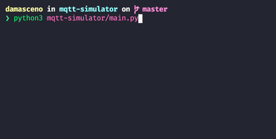

# 📡 MQTT Simulator

Simulador IoT leve e configurável para publicar dados JSON em brokers MQTT, simulando sensores e dispositivos.

[](https://www.python.org/)
[](https://www.eclipse.org/paho/)
[](https://azure.microsoft.com/services/iot-hub/)



---

## ✨ Funcionalidades

- Configuração simples via ficheiro JSON único
- Suporte para **MQTT tradicional** (Mosquitto, localhost)
- Suporte para **Azure IoT Hub** (cloud telemetry)
- Publicação em tópicos fixos ou dinâmicos (com IDs variáveis)
- Variação aleatória de dados baseada em parâmetros configuráveis
- Logging em tempo real durante simulação

---

## 🚀 Quick Start

### Executar com Python

```bash
# Usar configuração padrão (config/settings.json)
python3 mqtt-simulator/main.py

# Especificar ficheiro custom
python3 mqtt-simulator/main.py -f config/settings_azure.json
```

### Instalar Dependências

```bash
python3 -m venv venv
source venv/bin/activate  # Windows: venv\Scripts\activate
pip3 install -r requirements.txt
```

### Executar com uv (recomendado)

Sem necessidade de criar virtual environment manualmente:

```bash
uv run mqtt-simulator/main.py -f config/settings.json
```

### Executar com Docker

```bash
# Build
docker build -t mqtt-simulator .

# Run
docker run mqtt-simulator -f config/settings.json
```

---

## ⚙️ Configuração

### Modo MQTT (Broker Local)

```json
{
  "BROKER_TYPE": "mqtt",
  "BROKER_URL": "localhost",
  "BROKER_PORT": 1883,
  "TOPICS": [
    {
      "TYPE": "list",
      "PREFIX": "place",
      "LIST": ["roof", "basement"],
      "TIME_INTERVAL": 8,
      "DATA": [
        {
          "NAME": "temperature",
          "TYPE": "float",
          "MIN_VALUE": 20,
          "MAX_VALUE": 55,
          "MAX_STEP": 3
        }
      ]
    }
  ]
}
```

### Modo Azure IoT Hub

```json
{
  "BROKER_TYPE": "azure",
  "AZURE_CONNECTION_STRING": "HostName=your-hub.azure-devices.net;DeviceId=device1;SharedAccessKey=...",
  "TOPICS": [
    {
      "TYPE": "multiple",
      "PREFIX": "linha_producao/estacao",
      "RANGE_START": 1,
      "RANGE_END": 3,
      "TIME_INTERVAL": 60,
      "DATA": [
        {
          "NAME": "producao",
          "TYPE": "int",
          "MIN_VALUE": 50,
          "MAX_VALUE": 120
        }
      ]
    }
  ]
}
```

**Documentação completa**: [Configuration Guide](./docs/configuration.md)

---

## 🔧 Modos de Operação

### MQTT Tradicional

Conecta a qualquer broker MQTT:
- Mosquitto local
- HiveMQ Cloud
- Eclipse broker público

**Exemplo**:
```bash
python3 main.py -f config/settings_mqtt_localhost.json
```

### Azure IoT Hub

Envia telemetria diretamente para Azure:
- Device-to-cloud messaging
- Propriedades customizadas (topic name)
- Encoding automático UTF-8

**Exemplo**:
```bash
python3 main.py -f config/settings_azure.json
```

**Setup Azure**: Ver [Azure Integration Guide](README_AZURE_INTEGRATION.md)

---

## 📊 Tipos de Dados Suportados

| Tipo | Descrição | Exemplo |
|------|-----------|---------|
| `int` | Inteiro com variação | Contador de produção |
| `float` | Decimal com variação | Temperatura, pressão |
| `bool` | Booleano | Status on/off |
| `string` | Texto fixo ou variável | IDs, estados |

**Parâmetros de variação**:
- `MIN_VALUE` / `MAX_VALUE`: Limites
- `MAX_STEP`: Variação máxima entre leituras
- `RETAIN_PROBABILITY`: Probabilidade de manter valor
- `INCREASE_PROBABILITY`: Tendência de aumentar

---

## 🎯 Casos de Uso

### Desenvolvimento IoT
Testar aplicações IoT sem hardware físico.

### Testes de Carga
Simular centenas de sensores simultaneamente.

### Demonstrações
Criar demos com dados realistas.

### Integração Azure
Validar pipelines cloud antes do deploy.

---

## 📦 Dependências

**Modo MQTT**:
- `paho-mqtt==1.6.1`
- `pydantic==2.12.0`

**Modo Azure** (adicional):
- `azure-iot-device==2.14.0`

**Importante**: `paho-mqtt` deve ser **1.6.1** (não 2.x) por compatibilidade com Azure SDK.

```bash
pip install -r requirements.txt
```

---

## 🔍 Monitorização

### MQTT Local

```bash
# Subscrever a todos os tópicos
mosquitto_sub -h localhost -t '#' -v
```

### Azure IoT Hub

```bash
# Azure CLI - monitorizar telemetria
az iot hub monitor-events --hub-name YOUR-HUB-NAME

# Device específico
az iot hub monitor-events --hub-name YOUR-HUB-NAME --device-id DEVICE-ID
```

---

## 📚 Documentação Adicional

- **Configuração Detalhada**: [Configuration Guide](docs/configuration.md)
- **Azure Integration**: [Azure Setup](README_AZURE_INTEGRATION.md)
- **Exemplos**: [config/](config/) (vários settings.json)

---

## 🤝 Contribuidores Principais

Ver [contributors](../../graphs/contributors) para lista completa.

---

## 📄 Licença

Este projeto está sob licença open-source. Ver ficheiro LICENSE para detalhes.

---

## 🆘 Troubleshooting

**MQTT não conecta**:
```bash
# Verificar se broker está a correr
mosquitto -v
```

**Azure não conecta**:
```bash
# Verificar connection string
# Formato: HostName=...;DeviceId=...;SharedAccessKey=...
```

**Erro de dependências**:
```bash
# Reinstalar com versões corretas
pip install -r requirements.txt --force-reinstall
```

---

**Desenvolvido com ❤️ para simplificar testes IoT**